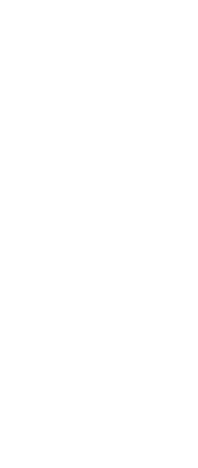

# Phishing URL Classifier

This repository contains a simple and fast machine learning pipeline for url phishing prediction.

```
Test Accuracy: 97.46%

Test Classification Report:

    | precision | recall | f1-score |
----|-----------|--------|----------|
 0  |    0.97   |  0.98  |   0.98   |
 1  |    0.98   |  0.97  |   0.97   |
```


## Prerequisites

Before using the script, make sure you have the necessary dependencies using `pip`:

```bash
pip install -r requirements.txt
```

### Then, to build the prediction pipeline, run the file:

```bash
python build.py
```
(Estimated running time: ~5 min)


## Usage (Script)

Example in the file `prediction_example.ipynb`.

If you want to use the model to predict in a python script you can do it like this:
```Python
# Import
import dill

# Load the predictor
with open('url_predictor.dill', 'rb') as f:
    predictor = dill.load(f)

# Use the predictor
urls = ["https://free-gift.com", "http://facebook.com"]
predictions = predictor.predict(urls)

print(predictions)
```
Output (probability of phishing):
```output
[0.74, 0.1]
```

# Pipeline




## Data

The data used to train the models was taken from Hugging Face.
https://huggingface.co/datasets/ealvaradob/phishing-dataset

## Code

You can explore the code in the `code/` folder.

## License
This project is licensed under the MIT License - see the [LICENSE](LICENSE) file for details.